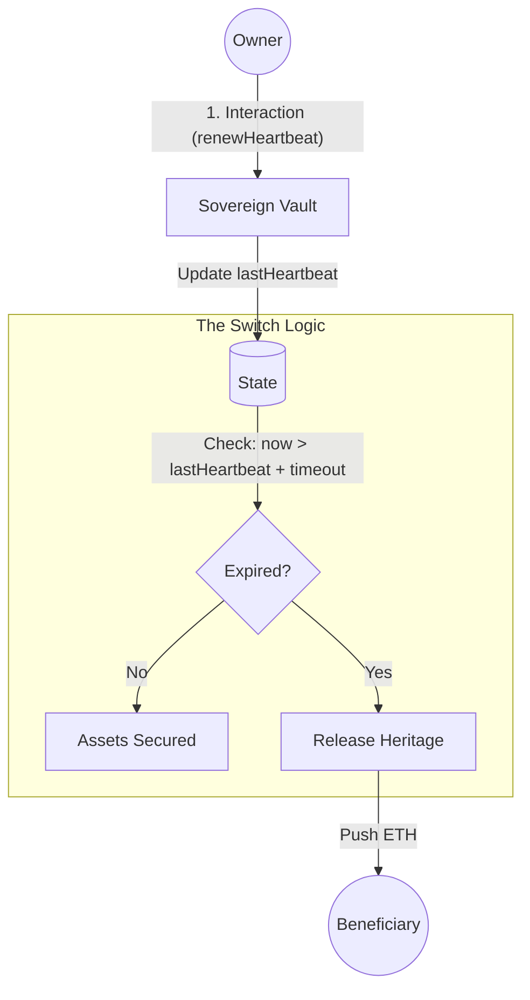

# Sovereign Switch (Base Heritage Module)

A minimalist, high-integrity Solidity mixin for permissionless asset recovery.
**No keepers. No oracles. 100% autonomous.**

> "Simplicity is the ultimate sophistication."

---

## The Problem

Most "Dead Man's Switch" or inheritance tools rely on off-chain infrastructure, third-party keepers, or complex encryption (Shamir's Secret Sharing).
**Critique:** If the keeper network or the relayers stop, your inheritance is locked forever. Complexity is the enemy of reliability.

## The Solution: The Biological Fuse

I built a mixin that treats the owner's activity as a "heartbeat". It acts like a time-delay fuse directly inside the EVM:

1. **Passive Monitoring:** Every critical interaction (withdraw, trade, etc.) automatically resets the timer.
2. **Hardcore Enforcement:** Once the timeout is reached, the contract state changes irreversibly, allowing anyone to push funds to the beneficiary.

> **Fail Safe:** This isn't a "pull" request from a beneficiary. It's a "push" mechanism that ensures funds reach their destination even if the beneficiary doesn't know how to interact with the contract.

---

## Architecture

We use an **Abstract Mixin Pattern** to ensure zero-cost integration.



---

## Design Philosophy (First Principles)

### 1. The Heartbeat (Low-Cost Monitoring)

Instead of a separate "ping" transaction, we use a modifier that hooks into your existing functions.

```solidity
modifier renewHeartbeat() {
    if (msg.sender == _getOwner()) {
        lastHeartbeat = block.timestamp;
        emit HeartbeatUpdated(block.timestamp);
    }
    _;
}

```

### 2. Zero-Dependency (Lego Brick)

The contract is **OpenZeppelin-free**. It doesn't force you into a specific ownership model.

* **Sovereignty:** You define `_getOwner()`. It works with EOA, Multi-sigs, or Smart Wallets.
* **Minimal Footprint:** Only 3 storage slots used.

### 3. Permissionless Liquidation

The `releaseHeritage()` function is public. If the fuse burns out, any actor (relayer, friend, or the beneficiary) can pay the gas to execute the transfer.

---

## Engineering Specs

* **Storage Slots:** 3 (`address`, `uint256`, `uint256`)
* **Gas Impact:** ~5-10k gas overhead on heartbeat updates.
* **Standard:** EVM 0.8.20+ (using `block.timestamp`).

---

## Implementation

```solidity
import "./SovereignHeritage.sol";

contract YourVault is SovereignHeritage {
    address public owner;

    constructor(address _beneficiary, uint256 _days) {
        owner = msg.sender;
        __SovereignHeritage_init(_beneficiary, _days);
    }

    function _getOwner() internal view override returns (address) {
        return owner;
    }

    // Critical functions reset the fuse
    function withdraw() external renewHeartbeat {
        // Business logic
    }
}

```

---

## Run Tests (Foundry)

```bash
# Install dependencies
forge install

# Run tests (Safety verification)
forge test -vv

```

---

## License

MIT.

### Author

Built with 💙 on Base by [Roman](https://www.linkedin.com/in/tilmatochek/).
